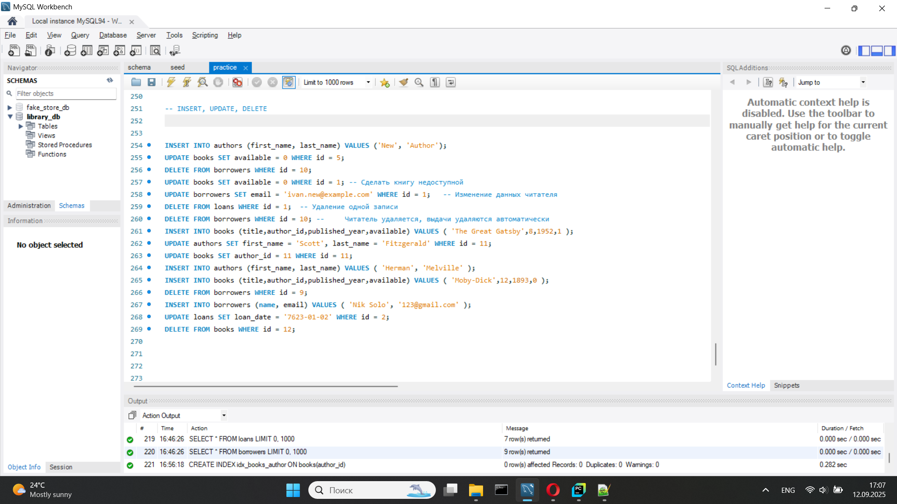
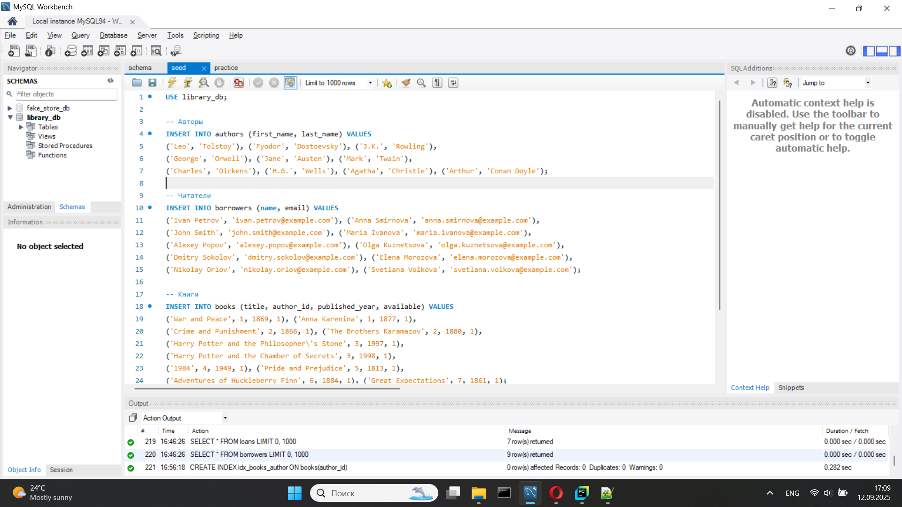
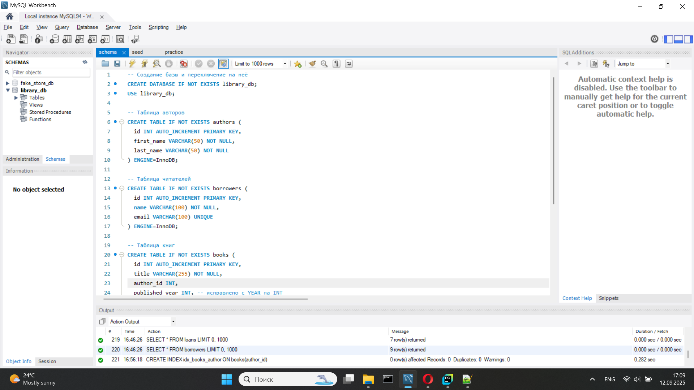

# Library DB — SQL Practice Project

A practical SQL project based on a library: books, authors, readers, and loans.  
All queries were executed and tested in **MySQL Workbench**.

**Project structure:**
- `practice.sql` — example queries and exercises  
- `schema/` — table structures  
- `seed/` — test data  
- `screenshots/` — screenshots from MySQL Workbench

**Capabilities:** SELECT, WHERE, ORDER BY, LIMIT, JOIN, GROUP BY, HAVING, subqueries, EXISTS, UNION, INSERT, UPDATE, DELETE.

**Screenshots:**  

