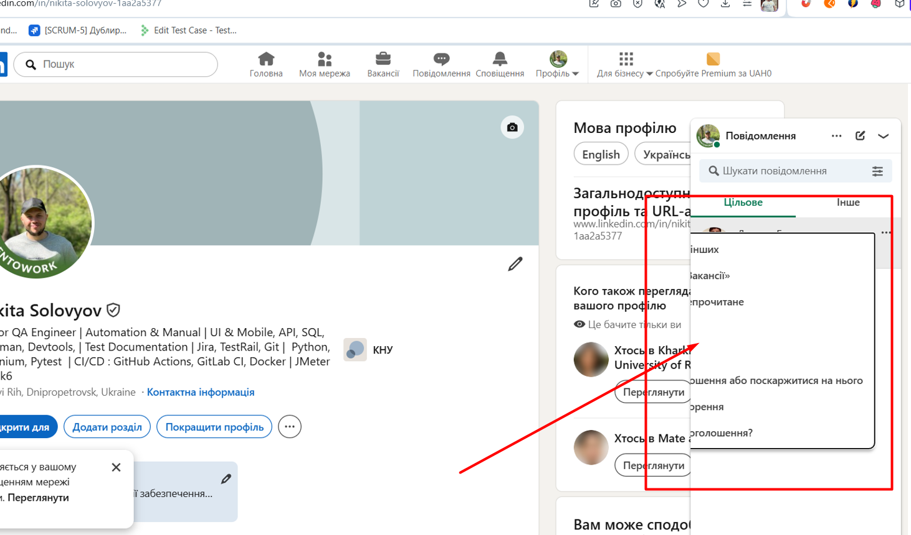

# 🐞 Bug Report

**ID:** UI-MSG-001  
**Title:** Dropdown menu ("…") in LinkedIn messages window exceeds container and displays incorrectly  

---

**Environment:**  
- **Platform:** Web (Desktop)  
- **OS:** Windows 11 24H2 
- **Browser:** Google Chrome 138.0.0.0  , Opera One(122.0.5643.142)
- **Screen Resolution:** 1920×1080  
- **Account:** Logged-in LinkedIn user  

**Severity:** Medium  
**Priority:** Medium  
**Defect Type:** UI / Usability  

---

**Preconditions:**  
User is logged in to [LinkedIn](https://www.linkedin.com/).  

---

**Steps to Reproduce:**  
1. Open [linkedin.com](https://www.linkedin.com/) in a browser.  
2. In the bottom-right corner, click the **Messages ("Повідомлення")** icon to open the chat window.  
3. Next to any message, click the three-dot icon ("⋯").  

---

**Actual Result:**  
The dropdown menu that opens when clicking the "⋯" icon is displayed incorrectly — it goes beyond the messages window.  
Part of the menu is cut off and not visible to the user. There is no scroll or automatic resizing of the menu.  

---

**Expected Result:**  
The dropdown menu should fully fit inside the messages window or adapt to its size (for example, open upwards/sideways or have vertical scrolling).  

---

**Attachments:**  
