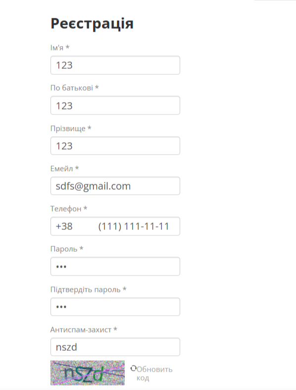
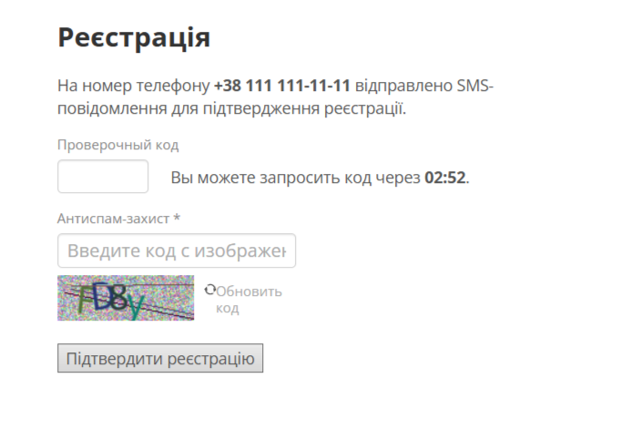

# Bug Report: Поля имени принимают цифры и спецсимволы

**ID:** BUG-001  
**Project:** Registration form  
**Priority:** Medium  
**Severity:** Major  
**Environment:** Windows 11 (23H2), Opera One 120.0.5543.93  

---

### Description
В форме регистрации поля **First Name**, **Middle Name** и **Last Name** позволяют вводить цифры и специальные символы. Данные сохраняются, система не выдает предупреждений.

---

### Steps to Reproduce
1. Перейти на сайт: `https://exe.ua`  
2. Нажать кнопку **Sign up**  
3. Ввести в поля имени цифры или символы (например: `123`, `@#$`)  
4. Заполнить остальные поля корректно  
5. Нажать **Sign up**  

---

### Expected Result
Система должна отклонять недопустимый ввод и показать сообщение об ошибке:  
*“Only letters allowed”*.  
Регистрация не должна завершаться.

---

### Actual Result
Регистрация успешно проходит, в полях имени сохраняются цифры и символы.  

---

### Attachments
 