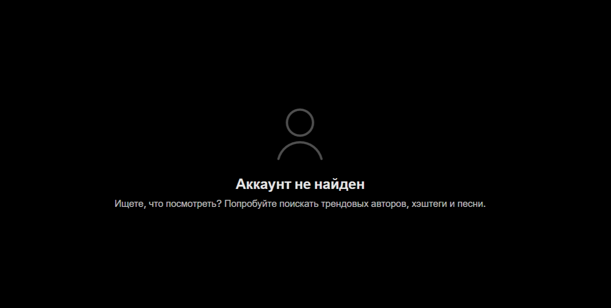

# Bug Report: TikTok Icon Leads to Non-Existent Account

**ID:** BUG-003  
**Project:** Header navigation  
**Priority:** Low  
**Severity:** Minor  
**Environment:** Windows 11 (23H2), Opera One 120.0.5543.93  

---

### Description
In the website header, clicking the **TikTok** icon opens a page with an error: *“Account not found”*.  

---

### Steps to Reproduce
1. Go to the website: [gruzfishdnipro](https://gruzfishdnipro.com.ua/ru)  
2. Click the **TikTok** icon in the header  

---

### Expected Result
The official TikTok account of the company should open.  

---

### Actual Result
A new window opens with an error: *“Account not found”*.  

---

### Attachments
   