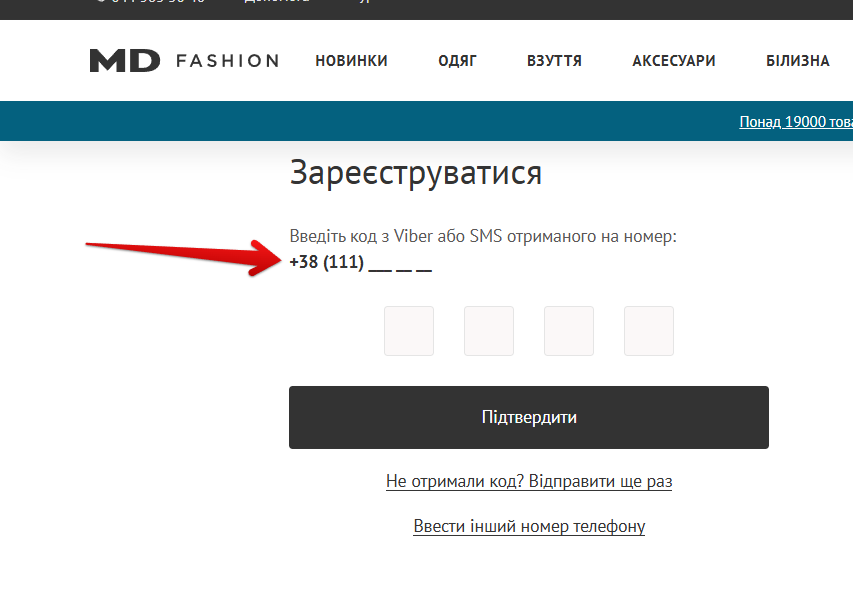

# Bug Report: Регистрация проходит при некорректном номере телефона

**ID:** BUG-004  
**Project:** Registration form  
**Priority:** High  
**Severity:** Major  
**Environment:** Windows 11 (23H2), Opera One 120.0.5543.93  

---

### Description
При регистрации через вариант **«Отримати код за допомогою SMS»** система принимает номер телефона неполной длины и продолжает процесс без ошибки валидации.

---

### Preconditions
Открыть сайт: [MD Fashion](https://md-fashion.ua)

---

### Steps to Reproduce
1. В хедере нажать **«Зареєструватися»**.  
2. В поле **«Телефон»** ввести короткий номер (например, `11111`).  
3. Нажать **«Підтвердити»**.

---

### Expected Result
Отображается ошибка о некорректном номере; переход к вводу кода не выполняется.

---

### Actual Result
Открывается окно с текстом: *«Введіть код з Viber або SMS отриманого на номер»*, хотя номер введён неверно.

---

### Attachments
