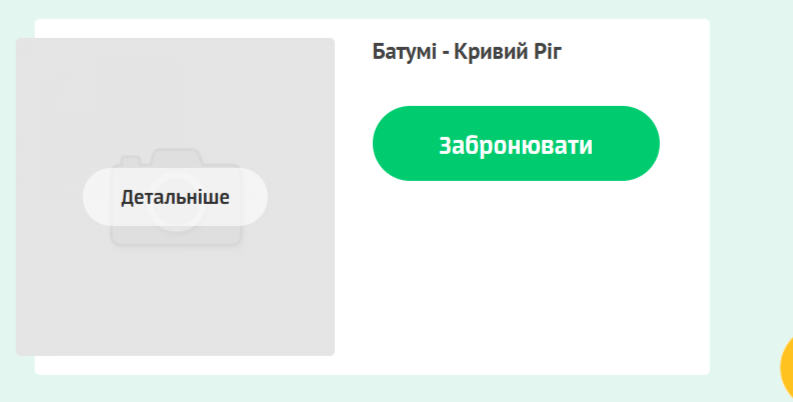

# Bug Report: Отсутствуют изображения у маршрутов

**ID:** BUG-005  
**Project:** Routes section  
**Priority:** Medium  
**Severity:** Minor  
**Environment:** Windows 11 (23H2), Opera One 120.0.5543.93  

---

### Description
В разделе **«Маршруты»** у нескольких направлений не загружены изображения — вместо фото отображается заглушка *noimage.png*.  

---

### Preconditions
Перейти на сайт: [КС-ТРАНС](https://kstrans.com.ua)  

---

### Steps to Reproduce
1. На главной странице найти блок **«Наші популярні маршрути»**.  
2. Нажать кнопку **«Дивитись усі напрямки»**.  
3. В списке маршрутов обратить внимание на следующие направления:  
   - Варшава – Кривий Ріг  
   - Каунас – Кривий Ріг  
   - Стамбул – Кривий Ріг  
   - Люблін – Кривий Ріг  
   - Тбілісі – Кривий Ріг  
   - Батумі – Кривий Ріг  

---

### Expected Result
У всех маршрутов должно быть уникальное изображение.  

---

### Actual Result
У перечисленных маршрутов вместо фото отображается заглушка *noimage.png*.  

---

### Attachments
  
  
  
  
  
 