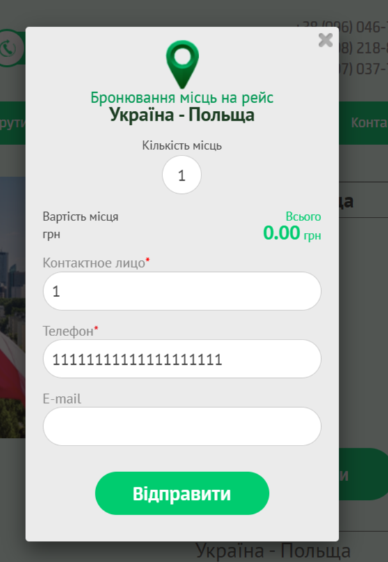
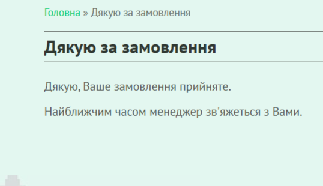

# Bug Report: Форма бронирования принимает некорректный номер телефона

**ID:** BUG-006  
**Project:** Booking form  
**Priority:** High  
**Severity:** Major  
**Environment:** Windows 11 (23H2), Opera One 120.0.5543.93  

---

### Description
В форме бронирования билета в поле «Телефон» можно вводить некорректные данные. Они проходят валидацию, и заявка успешно отправляется.

---

### Preconditions
Перейти на сайт: [КС-ТРАНС](https://kstrans.com.ua)  

---

### Steps to Reproduce
1. В верхней части страницы нажать **«Маршрути»**.  
2. В списке выбрать **«Німеччина»**.  
3. На новой странице найти маршрут **«Україна – Німеччина»**.  
4. Нажать кнопку **«Забронювати»**.  
5. В форме бронирования заполнить поля:  
   - Контактне лице → `1`  
   - Телефон → `1111111111111111`  
6. Нажать **«Відправити»**.  

---

### Expected Result
Система должна показать ошибку о неверно введённом номере телефона.  
Заявка не должна отправляться.  

---

### Actual Result
Появляется окно с сообщением об успешном оформлении бронирования, хотя номер телефона введён некорректно.  

---

### Attachments

