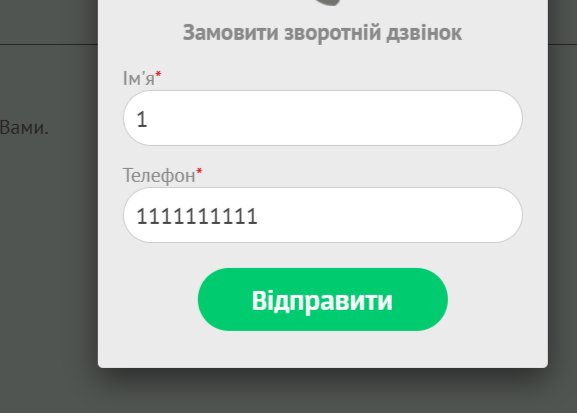

# Bug Report: Callback Form Accepts Invalid Phone Numbers

**ID:** BUG-008  
**Project:** Callback form  
**Priority:** Medium  
**Severity:** Major  
**Environment:** Windows 11 (23H2), Opera One 120.0.5543.93  

---

### Description
In the callback form, the **Phone Number** field accepts any numeric value longer than 10 digits. After entering such a number, the request is submitted successfully without any validation.  

---

### Preconditions
Go to the website: [KS-TRANS](https://kstrans.com.ua)  

---

### Steps to Reproduce
1. Click the **“Callback”** trigger in the header  
2. Enter in the fields:  
   - Name: `1`  
   - Phone: `11111111111111111111`  
3. Click **“Send”**  

---

### Expected Result
An error should appear for the invalid phone number, or the request should not be submitted.  

---

### Actual Result
A page appears confirming the callback request was successfully sent.  

---

### Attachments
   