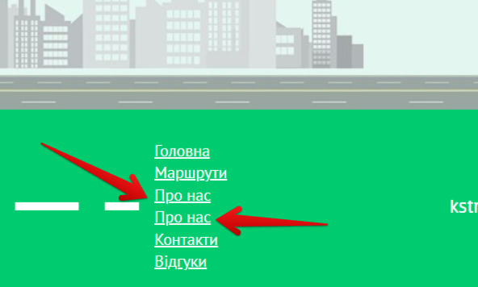

# Bug Report: Duplicate "About Us" Category in Footer

**ID:** BUG-009  
**Project:** KS-TRANS website  
**Priority:** Low  
**Severity:** Minor  
**Environment:** Windows 11 (23H2), Opera One 120.0.5543.93  

---

### Description
In the website footer, the **“About Us”** category is duplicated.  

---

### Preconditions
Go to the website: [KS-TRANS](https://ks-trans.org)  

---

### Steps to Reproduce
1. Open the website  
2. Scroll down to the footer  
3. Check the list of categories  

---

### Expected Result
The **“About Us”** category should appear only once.  

---

### Actual Result
The **“About Us”** category appears twice.  

---

### Attachments
  