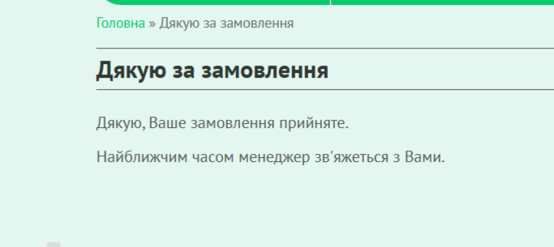
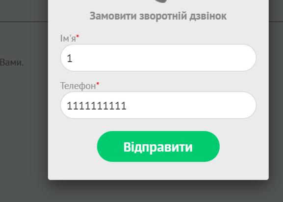

# Bug Report: Callback Form Accepts Invalid Phone Numbers Without Validation

**ID:** BUG-011  
**Project:** KS-TRANS website  
**Priority:** Medium  
**Severity:** Major  
**Environment:** Windows 11 (23H2), Opera One 120.0.5543.93  

---

### Description
The **Callback Form** allows submitting phone numbers with an invalid format.  
The "Phone Number" field accepts any numeric input longer than 10 digits, and the request still goes through as successful.

---

### Steps to Reproduce
1. Open the website [KS-TRANS](https://ks-trans.org).  
2. In the header, click the **"Зворотній зв'язок"** (Callback) button.  
3. Fill in the fields:  
   - Name: `1`  
   - Phone: `11111111111111111111`  
4. Click the **“Відправити”** (Submit) button.  

---

### Expected Result
An error message should appear indicating the phone number is invalid.  
The request should not be submitted until a valid phone number is entered.  

---

### Actual Result
The form submits successfully, and a success page is displayed.  

---

### Attachments
  
  