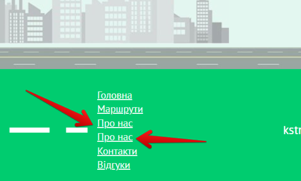

# Bug Report: Duplicate "About Us" Category in Footer

**ID:** BUG-012  
**Project:** KS-TRANS website  
**Priority:** Low  
**Severity:** Minor  
**Environment:** Windows 11 (23H2), Opera One 120.0.5543.93  

---

### Description
In the footer section of the website, the **"About Us"** category is displayed twice. This looks like a UI issue and may confuse users.  

---

### Steps to Reproduce
1. Open the website [KS-TRANS](https://ks-trans.org).  
2. Scroll down to the footer.  
3. Observe the categories listed.  

---

### Expected Result
There should be only one **"About Us"** category in the footer.  

---

### Actual Result
The **"About Us"** category is duplicated in the footer.  

---

### Attachments
 