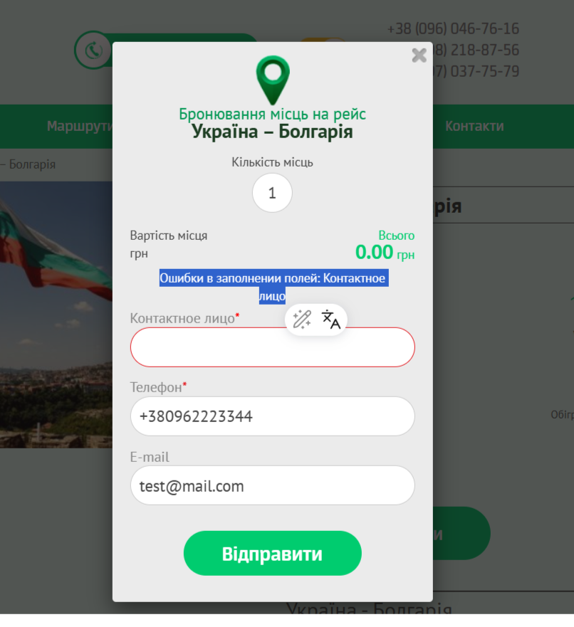
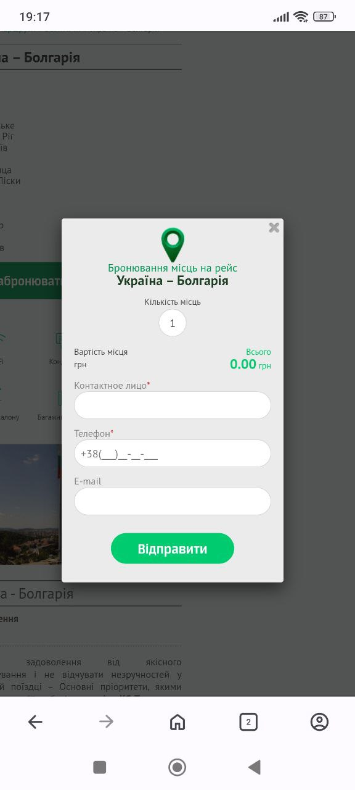

# 📄 Test Cases: Booking (Trip Reservation)

---

### TC-BOOK-001: Submit form with valid data
**Preconditions:**  
1. Open the page [KS-Trans](https://ks-trans.org/ukraina-bolgariya.html)  
2. Click "Забронювати"  

**Steps:**  
1. Fill "Contact person" field: "Nikita"  
2. Fill "Phone" field: "+380962223344"  
3. Fill "E-mail" field: "test@mail.com"  
4. Click "Відправити"  

**Expected Result:**  
The page "Дякую за замовлення" opens.

**Status:** Pass

---

### TC-BOOK-002: Submit form with empty required fields
**Preconditions:**  
1. Open the page [KS-Trans](https://ks-trans.org/ukraina-bolgariya.html)  
2. Click "Забронювати"  

**Steps:**  
1. Leave fields empty  
2. Click "Відправити"  

**Expected Result:**  
Error message appears: "Field errors: Contact person, Phone".

**Status:** Pass

---

### TC-BOOK-003: Submit form with incorrect phone
**Preconditions:**  
1. Open the page [KS-Trans](https://ks-trans.org/ukraina-bolgariya.html)  
2. Click "Забронювати"  

**Steps:**  
1. Fill "Contact person": "Nikita"  
2. Fill "Phone": "abc123"  
3. Fill "E-mail": "test@mail.com"  
4. Click "Відправити"  

**Expected Result:**  
Form is not submitted, error shown: "Field errors: Phone".

**Status:** Pass

---

### TC-BOOK-004: Submit form with empty name
**Preconditions:**  
1. Open the page [KS-Trans](https://ks-trans.org/ukraina-bolgariya.html)  
2. Click "Забронювати"  

**Steps:**  
1. Leave "Contact person" empty  
2. Fill "Phone": "+380962223344"  
3. Fill "E-mail": "test@mail.com"  
4. Click "Відправити"  

**Expected Result:**  
Form is not submitted, error shown: "Field errors: Contact person".

**Status:** Pass

---

### TC-BOOK-005: Check form closing
**Preconditions:**  
1. Open the page [ukraina-bolgariya](https://ks-trans.org/ukraina-bolgariya.html)  
2. Click "Забронювати"  

**Steps:**  
1. Click the close (×) button  

**Expected Result:**  
Form closes, user returns to the route page.

**Status:** Pass

---

### TC-BOOK-006: Check form responsiveness
**Preconditions:**  
1. Open the page [KS-Trans](https://ks-trans.org/ukraina-bolgariya.html) on a mobile device  
2. Click "Забронювати"  

**Steps:**  
1. Check form display on mobile screen  
2. Try filling and submitting the form  

**Expected Result:**  
Form displays correctly on mobile, fields and buttons are readable and accessible.

**Status:** Pass

