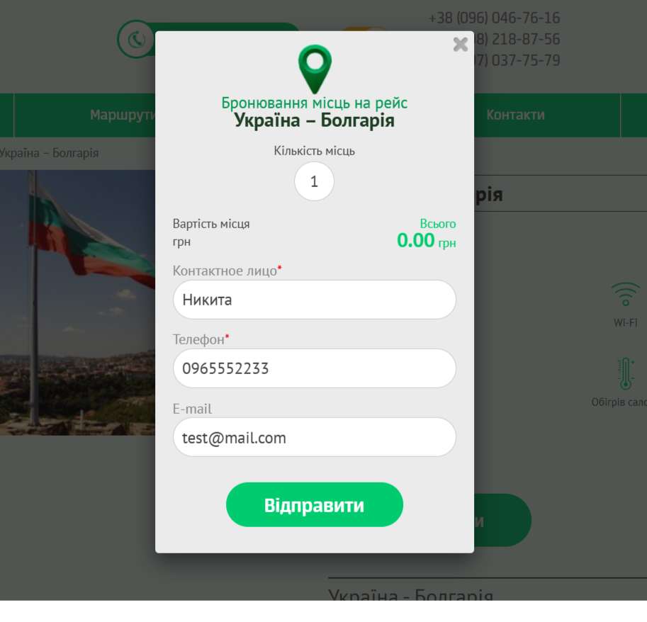
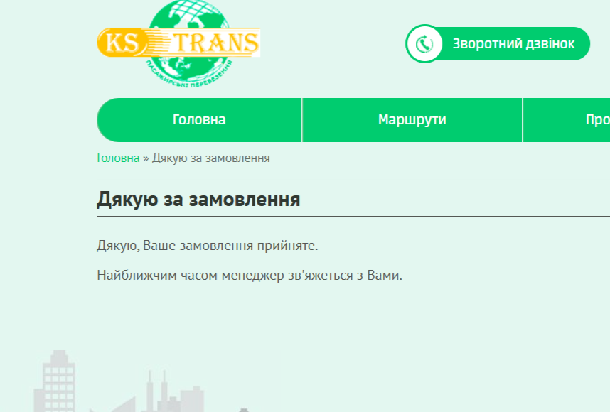
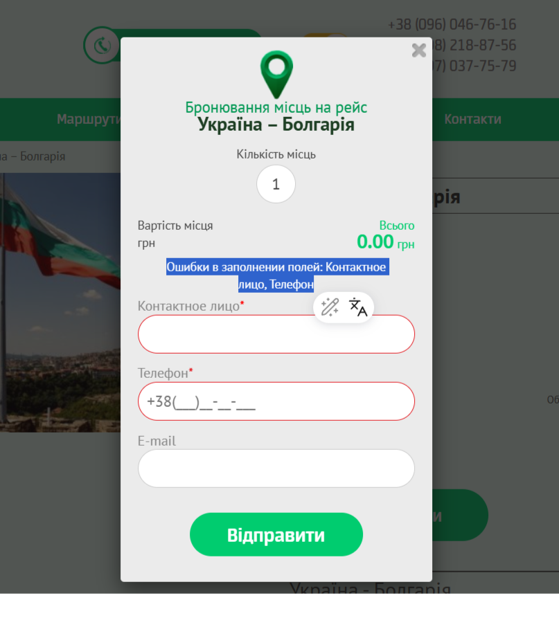
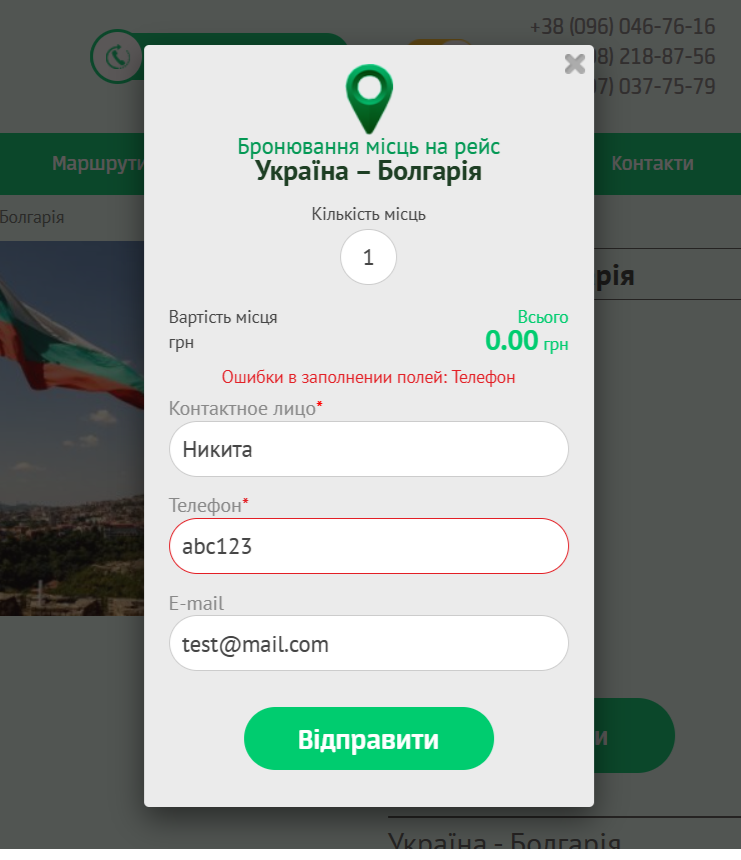

# 📄 Test Cases: Booking (оформление поездки)

---

### TC-BOOK-001: Отправка формы с валидными данными  
**Предусловия:**  
1. Открыть страницу [Україна–Болгарія](https://ks-trans.org/ukraina-bolgariya.html)    
2. Нажать «Забронювати»  

**Шаги:**  
1. Заполнить поле «Контактное лицо»: "Никита"  
2. Заполнить поле «Телефон»: "+380962223344"  
3. Заполнить поле E-mail: "test@mail.com"  
4. Нажать кнопку "Відправити"  

**Ожидаемый результат:**  
Откроется страница «Дякую за замовлення».  

**Статус:** Pass 

---

### TC-BOOK-002: Отправка формы с пустыми обязательными полями  
**Предусловия:**  
1. Открыть страницу [Україна–Болгарія](https://ks-trans.org/ukraina-bolgariya.html)  
2. Нажать «Забронювати»  

**Шаги:**  
1. Оставить поля пустыми  
2. Нажать кнопку "Відправити"  

**Ожидаемый результат:**  
Отображается сообщение об ошибке: «Ошибки в заполнении полей: Контактное лицо, Телефон».  

**Статус:** Pass  

---

### TC-BOOK-003: Отправка формы с некорректным телефоном  
**Предусловия:**  
1. Открыть страницу [Україна–Болгарія](https://ks-trans.org/ukraina-bolgariya.html)  
2. Нажать «Забронювати»  

**Шаги:**  
1. Заполнить поле «Контактное лицо»: "Никита"  
2. Заполнить поле «Телефон»: "abc123"  
3. Заполнить поле E-mail: "test@mail.com"  
4. Нажать кнопку "Відправити"  

**Ожидаемый результат:**  
Форма не отправляется, отображается ошибка: «Ошибки в заполнении полей: Телефон».  

**Статус:** Pass  

---

### TC-BOOK-004: Отправка формы с пустым именем  
**Предусловия:**  
1. Открыть страницу [Україна–Болгарія](https://ks-trans.org/ukraina-bolgariya.html)  
2. Нажать «Забронювати»  

**Шаги:**  
1. Оставить поле «Контактное лицо» пустым  
2. Заполнить поле «Телефон»: "+380962223344"  
3. Заполнить поле E-mail: "test@mail.com"  
4. Нажать кнопку "Відправити"  

**Ожидаемый результат:**  
Форма не отправляется, появляется ошибка: «Ім’я обов’язкове для заповнення».  

**Статус:** Pass/Fail  

---

### TC-BOOK-005: Отправка формы с некорректным email  
**Предусловия:**  
1. Открыть страницу [Україна–Болгарія](https://ks-trans.org/ukraina-bolgariya.html)  
2. Нажать «Забронювати»  

**Шаги:**  
1. Заполнить поле «Контактное лицо»: "Никита"  
2. Заполнить поле «Телефон»: "+380962223344"  
3. Заполнить поле E-mail: "test@.com"  
4. Нажать кнопку "Відправити"  

**Ожидаемый результат:**  
Форма не отправляется, появляется ошибка: «Некоректний email».  

**Статус:** Pass/Fail  

---

### TC-BOOK-006: Проверка закрытия формы  
**Предусловия:**  
1. Открыть страницу [Україна–Болгарія](https://ks-trans.org/ukraina-bolgariya.html)  
2. Нажать «Забронювати»  

**Шаги:**  
1. Нажать на крестик (×) для закрытия формы  

**Ожидаемый результат:**  
Форма закрывается, пользователь возвращается на страницу маршрута.  

**Статус:** Pass/Fail  

---

### TC-BOOK-007: Проверка адаптивности формы  
**Предусловия:**  
1. Открыть страницу [Україна–Болгарія](https://ks-trans.org/ukraina-bolgariya.html) в мобильной версии  
2. Нажать «Забронювати»  

**Шаги:**  
1. Проверить отображение формы на мобильном экране  
2. Попробовать заполнить и отправить форму  

**Ожидаемый результат:**  
Форма корректно отображается на мобильных устройствах, поля и кнопки читаемы и доступны.  

**Статус:** Pass/Fail  

