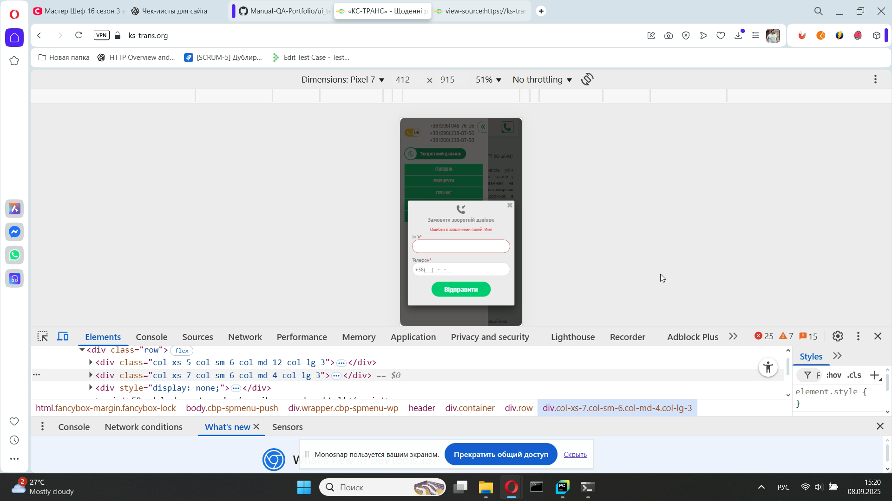

# Тест-кейсы: Callback Form (KS-Trans)

---

### TC-CB-007 – Проверка отображения формы  
**Предусловие:**
- Зайти на сайт [КС-ТРАНС](https://ks-trans.org)

**Шаги:**  
1. Нажать на кнопку «Зворотний дзвінок» в футере.

**Ожидаемый результат:**  
Открывается форма обратного звонка с полями «Ім’я», «Телефон», кнопкой «Відправити».  

**Статус:** Pass 

---

### TC-CB-008 – Отправка формы с корректными данными  
**Предусловие:**  
1.Зайти на сайт [КС-ТРАНС](https://ks-trans.org)  
2.Нажать на кнопку «Зворотний дзвінок» в футере.

**Шаги:**  
1. Ввести имя: `Вася`.  
2. Ввести телефон: `+380991112233`.  
3. Нажать «Відправити».  

**Ожидаемый результат:**  
Форма отправляется, Откроется страница «Дякую за замовлення».

**Статус:** Pass 

---

### TC-CB-009 – Отправка формы с пустыми полями  
**Предусловие:**  
1.Зайти на сайт [КС-ТРАНС](https://ks-trans.org)  
2.Нажать на кнопку «Зворотний дзвінок» в футере.

**Шаги:**  
1. Не заполнять поля.  
2. Нажать «Відправити».  

**Ожидаемый результат:**  
Появляется сообщение об ошибке: «Ошибки в заполнении полей: Имя, Телефон»

**Статус:** Pass 

---

### TC-CB-010 – Ввод некорректного номера телефона  
**Предусловие:**  
1.Зайти на сайт [КС-ТРАНС](https://ks-trans.org)  
2.Нажать на кнопку «Зворотний дзвінок» в футере.

**Шаги:**  
1. Ввести имя: `Вася`.  
2. Ввести телефон: `abc123`.
3. Нажать «Відправити».  

**Ожидаемый результат:**  
Форма не отправляется, появляется ошибка: «Ошибки в заполнении полей: Телефон».  

**Статус:** Pass 

---

### TC-CB-011 – Отправка формы с пустым именем  
**Предусловие:**  
1.Зайти на сайт [КС-ТРАНС](https://ks-trans.org)  
2.Нажать на кнопку «Зворотний дзвінок» в футере.

**Шаги:**  
1. Оставить поле «Ім’я» пустым.  
2. Ввести телефон: `+380991112233`.  
3. Нажать «Відправити».  

**Ожидаемый результат:**  
Форма не отправляется, появляется ошибка: «Ошибки в заполнении полей: Имя».  

**Статус:** Pass 

---

### TC-CB-012 – Проверка закрытия формы  
**Предусловие:**  
1.Зайти на сайт [КС-ТРАНС](https://ks-trans.org)  
2.Нажать на кнопку «Зворотний дзвінок» в футере.

**Шаги:**  
1. Нажать на крестик (×) закрытия формы. 

**Ожидаемый результат:**  
Форма закрывается, пользователь возвращается на страницу сайта.  

**Статус:** Pass 

---

### TC-CB-0013 – Проверка адаптивности формы  
**Предусловие:**  
1.Зайти на сайт [КС-ТРАНС](https://ks-trans.org) в мобильную версию.

**Шаги:**  
1. В бургер-меню нажать форму «Зворотний дзвінок».  

**Ожидаемый результат:**  
Форма корректно отображается на экране телефона, текст и кнопки читаемы и доступны.  

**Статус:** Pass 

