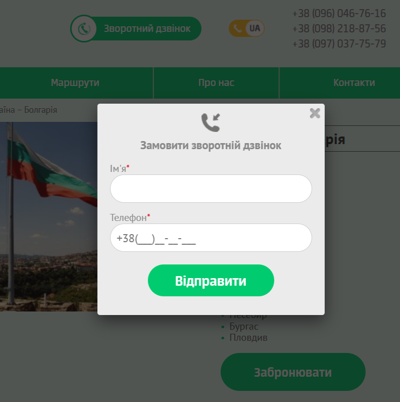
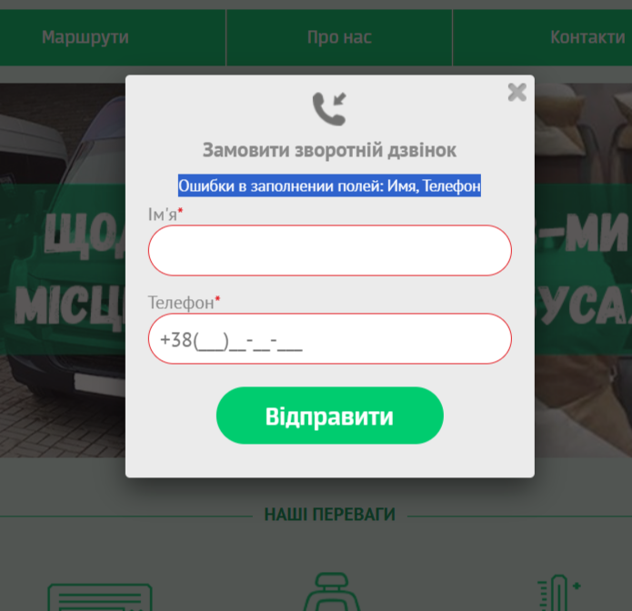
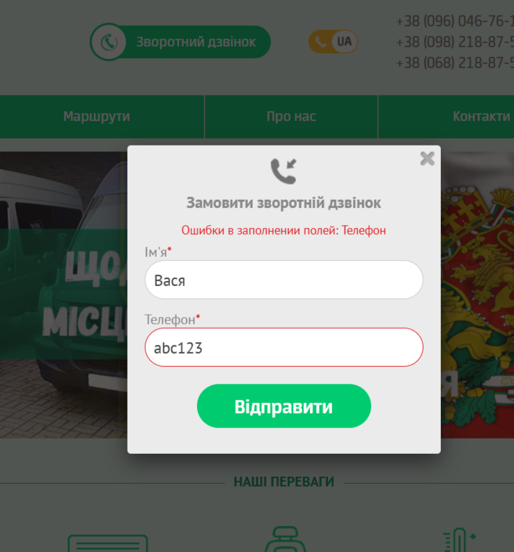
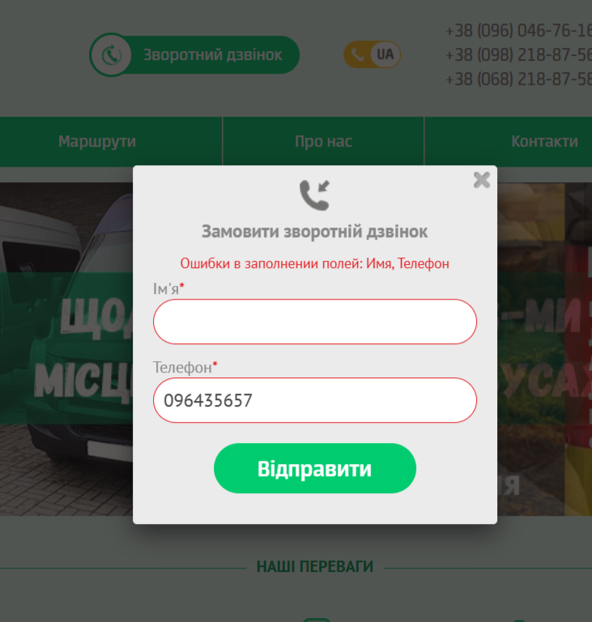
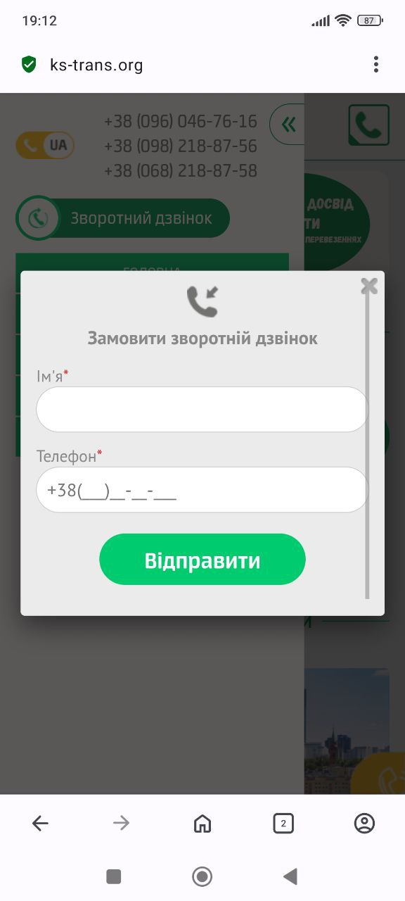

# 📄 Test Cases: Callback Form (KS-Trans)

---

### TC-CB-007 – Check form display
**Precondition:**  
- Open the site [KS-Trans](https://ks-trans.org)

**Steps:**  
1. Click the "Зворотний дзвінок" button in the footer.

**Expected Result:**  
The callback form opens with fields "Name", "Phone" and a "Відправити" button.

**Status:** Pass

---

### TC-CB-008 – Submit form with valid data
**Precondition:**  
1. Open the site [KS-Trans](https://ks-trans.org)  
2. Click the "Зворотний дзвінок" button in the footer.

**Steps:**  
1. Enter Name: `Vasya`  
2. Enter Phone: `+380991112233`  
3. Click "Відправити"

**Expected Result:**  
Form is submitted, and the page "Дякую за замовлення" opens.

**Status:** Pass

---

### TC-CB-009 – Submit form with empty fields
**Precondition:**  
1. Open the site [KS-Trans](https://ks-trans.org)  
2. Click the "Зворотний дзвінок" button in the footer.

**Steps:**  
1. Leave fields empty  
2. Click "Відправити"

**Expected Result:**  
Error message appears: "Field errors: Name, Phone"

**Status:** Pass

---

### TC-CB-010 – Enter invalid phone number
**Precondition:**  
1. Open the site [KS-Trans](https://ks-trans.org)  
2. Click the "Зворотний дзвінок" button in the footer.

**Steps:**  
1. Enter Name: `Vasya`  
2. Enter Phone: `abc123`  
3. Click "Відправити"

**Expected Result:**  
Form is not submitted, error shown: "Field errors: Phone"

**Status:** Pass

---

### TC-CB-011 – Submit form with empty name
**Precondition:**  
1. Open the site [KS-Trans](https://ks-trans.org)  
2. Click the "Зворотний дзвінок" button in the footer.

**Steps:**  
1. Leave "Name" empty  
2. Enter Phone: `+380991112233`  
3. Click "Відправити"

**Expected Result:**  
Form is not submitted, error shown: "Field errors: Name"

**Status:** Pass

---

### TC-CB-012 – Check form closing
**Precondition:**  
1. Open the site [KS-Trans](https://ks-trans.org)  
2. Click the "Зворотний дзвінок" button in the footer.

**Steps:**  
1. Click the close (×) button

**Expected Result:**  
Form closes, user returns to the site page.

**Status:** Pass

---

### TC-CB-013 – Check form responsiveness
**Precondition:**  
1. Open the site [KS-Trans](https://ks-trans.org) on a mobile device.

**Steps:**  
1. In the burger menu, click the "Зворотний дзвінок" form.

**Expected Result:**  
Form displays correctly on the mobile screen, text and buttons are readable and accessible.

**Status:** Pass

 