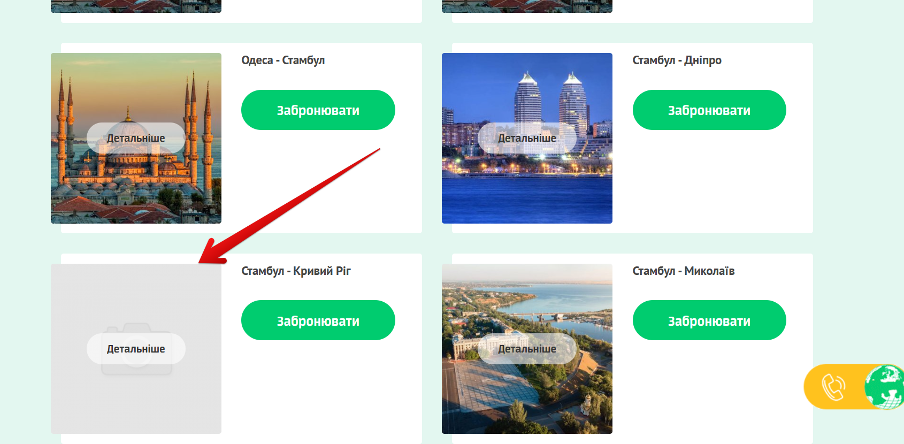

# 📄 Тест-кейсы: General UI (KS-Trans)

---

### TC-GEN-0028 – Проверка корректности текста 
**Предусловие:**  
- Зайти на сайт [КС-ТРАНС](https://ks-trans.org).  

**Шаги:**  
1. Пройтись по всем пунктам меню «Головна», «Про нас», «Маршрути», «Контакти», «Відгуки»
2. Проверить тексты блоков «Головна», «Про нас», «Маршрути», «Контакти», «Відгуки»  
3. Проверить номера телефонов компании

**Ожидаемый результат:**  
Все тексты отображаются без ошибок и опечаток, номера корректны и принадлежат компании.

**Статус:** Pass  

---

### TC-GEN-029 – Проверка ссылок в футере  
**Предусловие:**  
- Зайти на сайт [КС-ТРАНС](https://ks-trans.org).  

**Шаги:**  
1. Перейти в футер.  
2. Нажать на ссылки «Головна», «Маршрути», «Контакти», «Про нас».  

**Ожидаемый результат:**  
Ссылки работают и ведут на корректные страницы.  

**Статус:** Pass  

---

### TC-GEN-030 – Проверка загрузки картинок
**Предусловие:**  
- Зайти на сайт [КС-ТРАНС](https://ks-trans.org).  

**Шаги:**  
1. Пройтись по главной и страницам маршрутов.  
2. Проверить отображение всех картинок (логотип, слайдер, маршруты).  

**Ожидаемый результат:**  
Все картинки загружаются, нет битых ссылок.  

**Статус:** Fail  

  

---
