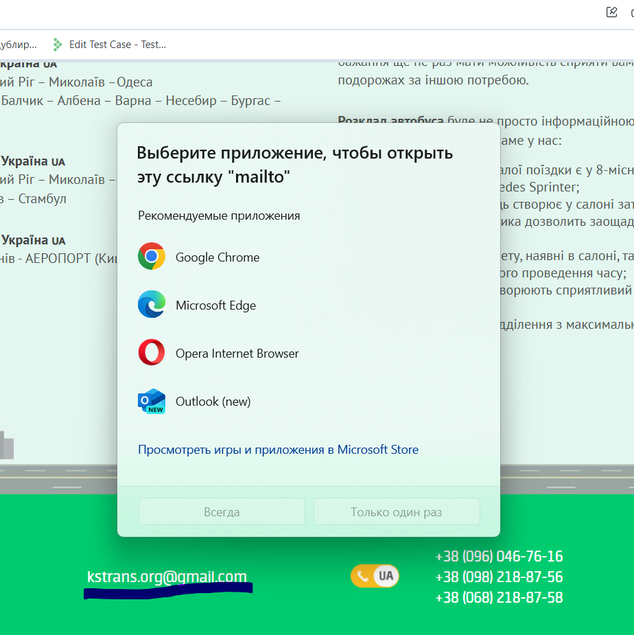
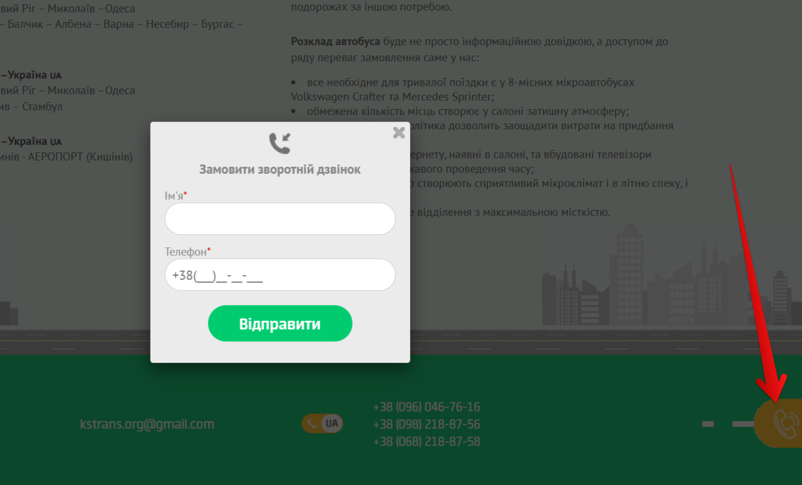

# 📄 Test Cases: Header & Footer (KS-Trans)

---

### TC-HF-019 – Logo navigation  
**Precondition:**  
1. Open the site [KS-Trans](https://ks-trans.org)  
2. Go to the "Routes" menu

**Steps:**  
- Click on the header logo

**Expected Result:**  
The user is redirected to the home page.

**Status:** Pass

---

### TC-HF-020 – Menu navigation check  
**Precondition:**  
- Open the site [KS-Trans](https://ks-trans.org)

**Steps:**  
1. Click "Routes"  
2. Click "Contacts"  
3. Click "About Us"  
4. Click "Reviews"  
5. Click "Home"

**Expected Result:**  
- Clicking "Routes" opens the routes list  
- Clicking "Contacts" opens the contacts page  
- Clicking "About Us" opens the company info page  
- Clicking "Reviews" opens the passenger reviews page  
- Clicking "Home" opens the home page

**Status:** Pass

---

### TC-HF-021 – Check footer email  
**Precondition:**  
- Open the site [KS-Trans](https://ks-trans.org)

**Steps:**  
1. Scroll down to the footer  
2. Click the email link

**Expected Result:**  
The default email client opens.

**Status:** Pass

---

### TC-HF-022 – Check footer "Callback" button  
**Precondition:**  
- Open the site [KS-Trans](https://ks-trans.org)

**Steps:**  
1. Scroll down to the footer  
2. Click "Callback"

**Expected Result:**  
The callback form opens.

**Status:** Pass

