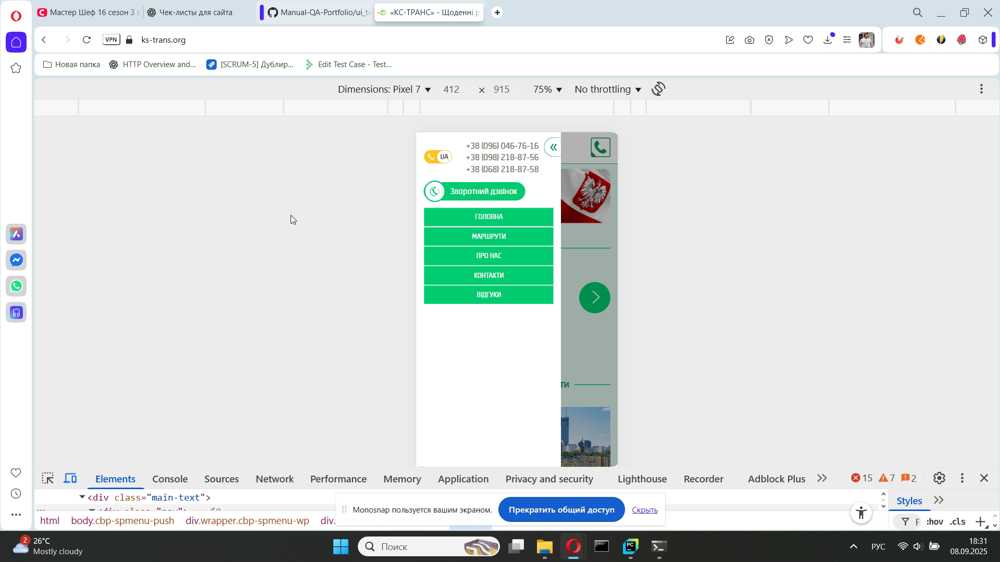
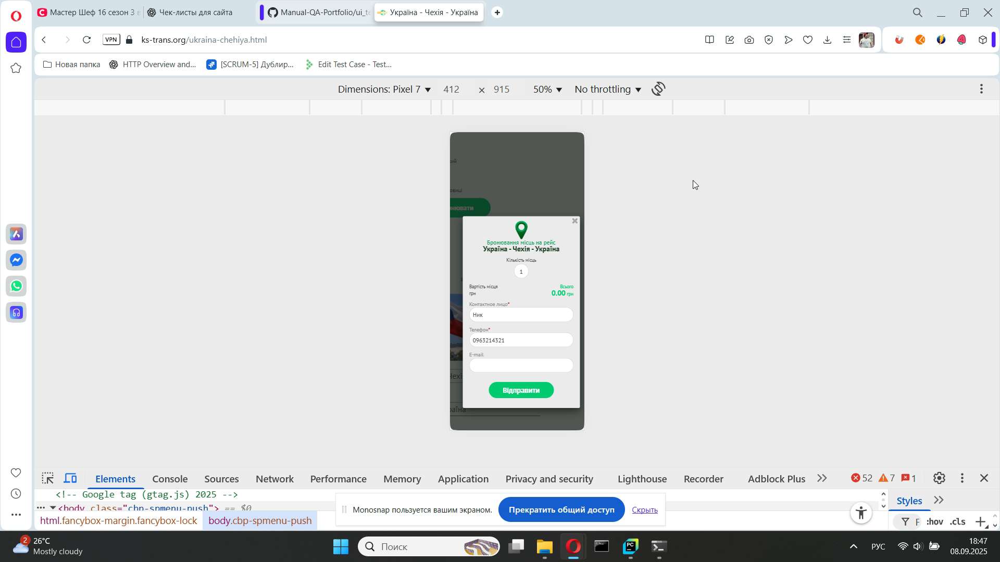
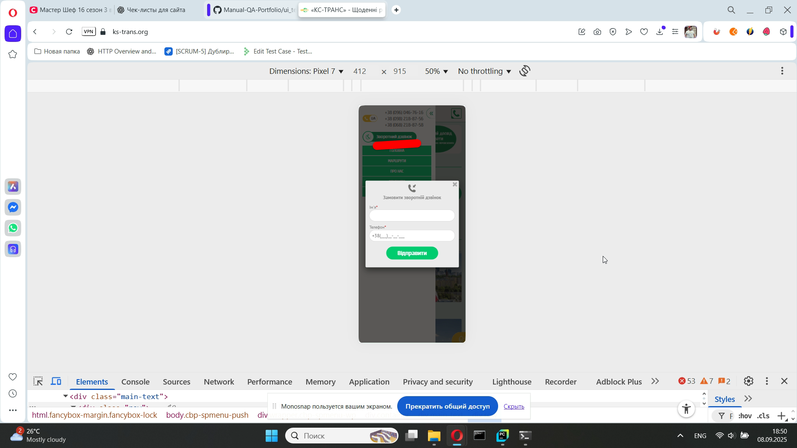

# 📄 Тест-кейсы: Mobile (KS-Trans)

---

### TC-MB-023 – Проверка бургер-меню  
**Предусловие:**  
- Зайти на сайт [КС-ТРАНС](https://ks-trans.org) на мобильном устройстве.  

**Шаги:**  
- Нажать на «бургер-меню».  

**Ожидаемый результат:**  
Открывается меню со ссылками («Головна», «Маршрути», «Контакти»...), номерами телефонов и кнопкой «Зворотний дзвінок».    

**Статус:** Pass  

  

---

### TC-MB-024 – Проверка переходов по бургер-меню  
**Предусловие:**  
- Зайти на сайт [КС-ТРАНС](https://ks-trans.org) на мобильном устройстве.  

**Шаги:**  
1. Нажать на бургер-меню.  
2. Выбрать пункт «Маршрути».  
3. Нажать на бургер-меню.  
4. Выбрать пункт «Контакти».  

**Ожидаемый результат:**  
- При выборе «Маршрути» открывается список маршрутов.  
- При выборе «Контакти» открывается страница с контактной информацией.  

**Статус:** Pass  

---

### TC-MB-025 – Проверка слайдера на мобильном  
**Предусловие:**  
- Зайти на сайт [КС-ТРАНС](https://ks-trans.org) на мобильном устройстве.  

**Шаги:**  
1. Просмотреть слайдер.  
2. Перелистать его свайпами влево/вправо.  

**Ожидаемый результат:**  
Слайды листаются свайпом, текст и изображения отображаются корректно.   

**Статус:** Pass  

---

### TC-MB-026 – Проверка формы заказа на мобильном  
**Предусловие:**  
- Зайти на страницу маршрута [Чехія-Украіна](https://ks-trans.org/ukraina-chehiya.html) с телефона.     

**Шаги:**  
1. Нажать кнопку «Забронювати».  
2. Заполнить форму заказа.  

**Ожидаемый результат:**  
Форма открывается и корректно отображается на мобильном, поля и кнопка доступны для заполнения.  

**Статус:** Pass  

  

---

### TC-MB-027 – Проверка формы обратного звонка на мобильном  
**Предусловие:**  
- Зайти на сайт [КС-ТРАНС](https://ks-trans.org) на мобильном устройстве.  

**Шаги:**  
1. Нажать на бургер-меню.  
2. Нажать на кнопку «Зворотний дзвінок»  

**Ожидаемый результат:**  
Форма корректно отображается, все поля доступны для ввода.  

**Статус:** Pass  

  

---