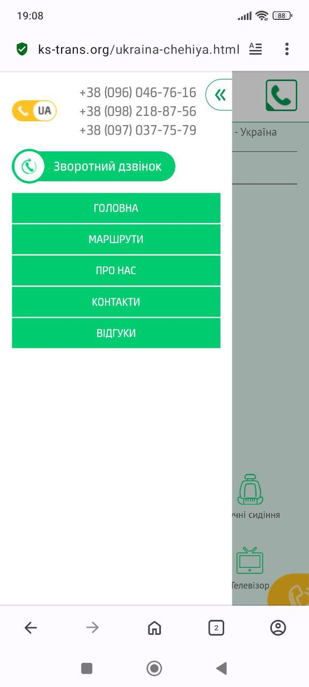

# 📄 Test Cases: Mobile (KS-Trans)

---

### TC-MB-023 – Burger menu check  
**Precondition:**  
- Open the site [KS-Trans](https://ks-trans.org) on a mobile device

**Steps:**  
- Tap the "burger menu"

**Expected Result:**  
The menu opens showing links ("Home", "Routes", "Contacts", ...), phone numbers, and the "Callback" button.

**Status:** Pass

---

### TC-MB-024 – Menu navigation on mobile  
**Precondition:**  
- Open the site [KS-Trans](https://ks-trans.org) on a mobile device

**Steps:**  
1. Tap the burger menu  
2. Select "Routes"  
3. Tap the burger menu again  
4. Select "Contacts"

**Expected Result:**  
- Selecting "Routes" opens the routes list  
- Selecting "Contacts" opens the contacts page

**Status:** Pass

---

### TC-MB-025 – Slider check on mobile  
**Precondition:**  
- Open the site [KS-Trans](https://ks-trans.org) on a mobile device

**Steps:**  
1. View the slider  
2. Swipe left/right to navigate slides

**Expected Result:**  
Slides swipe correctly, text and images display properly.

**Status:** Pass

---

### TC-MB-026 – Booking form on mobile  
**Precondition:**  
- Open a route page [Czechia-Ukraine](https://ks-trans.org/ukraina-chehiya.html) on a mobile device

**Steps:**  
1. Tap "Book"  
2. Fill in the booking form

**Expected Result:**  
Form opens and displays correctly on mobile; fields and button are accessible.

**Status:** Pass

---

### TC-MB-027 – Callback form on mobile  
**Precondition:**  
- Open the site [KS-Trans](https://ks-trans.org) on a mobile device

**Steps:**  
1. Tap the burger menu  
2. Tap the "Callback" button

**Expected Result:**  
Form displays correctly, all fields are accessible for input.

**Status:** Pass

