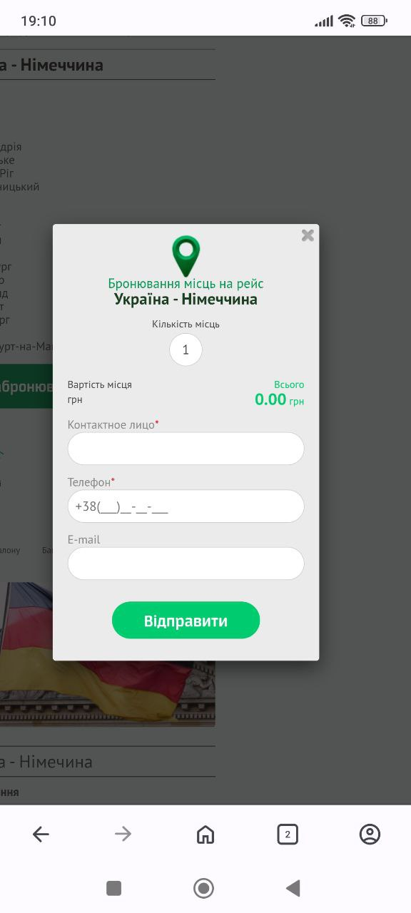

# 📄 Test Cases: Routes (KS-Trans)

---

### TC-RT-014 – Check routes list display  
**Precondition:**  
- Open the site [KS-Trans](https://ks-trans.org).

**Steps:**  
1. In the menu, click "View all destinations".

**Expected Result:**  
The "Routes" page opens.  
The list of routes is displayed, each card contains:  
- route name,  
- photo,  
- "Details" button,  
- "Book" button.

**Status:** Fail  

 

---

### TC-RT-015 – Check navigation to a route  
**Precondition:**  
- Open the site [KS-Trans](https://ks-trans.org).

**Steps:**  
1. Select the "Routes" menu.  
2. In the submenu, select "GERMANY".  
3. In the "GERMANY" section, click the route "Ukraine - Germany".

**Expected Result:**  
The route page opens with detailed description, photos, and "Book" button.

**Status:** Pass  

  

---

### TC-RT-016 – Check "Book" button inside a route  
**Precondition:**  
1. Open the site [KS-Trans](https://ks-trans.org).  
2. Select the "Routes" menu.  
3. In the submenu, select "GERMANY".  
4. In the "GERMANY" section, click the route "Ukraine - Germany".

**Steps:**  
1. Click the "Book" button.

**Expected Result:**  
The "Booking seats for the trip" form opens.

**Status:** Pass  

  

---

### TC-RT-017 – Check transport photos display  
**Precondition:**  
1. Open the site [KS-Trans](https://ks-trans.org).  
2. Select the "Routes" menu.  
3. Open any route.

**Steps:**  
1. Scroll to the bottom of the page.  
2. Check the "Transport photos" block.

**Expected Result:**  
Photos display correctly, no broken links or distorted images.

**Status:** Pass  

  

---

### TC-RT-018 – Check route page responsiveness  
**Precondition:**  
- Open the site [KS-Trans](https://ks-trans.org) on a mobile device.

**Steps:**  
1. Select the "Routes" menu.  
2. In the submenu, select "GERMANY".  
3. Click the route "Ukraine - Germany".  
4. Click the "Book" button.  
5. Click the close (×) button on the form.

**Expected Result:**  
The page displays correctly: photos and text adapt to screen size, buttons are accessible for tapping.

**Status:** Pass  

  