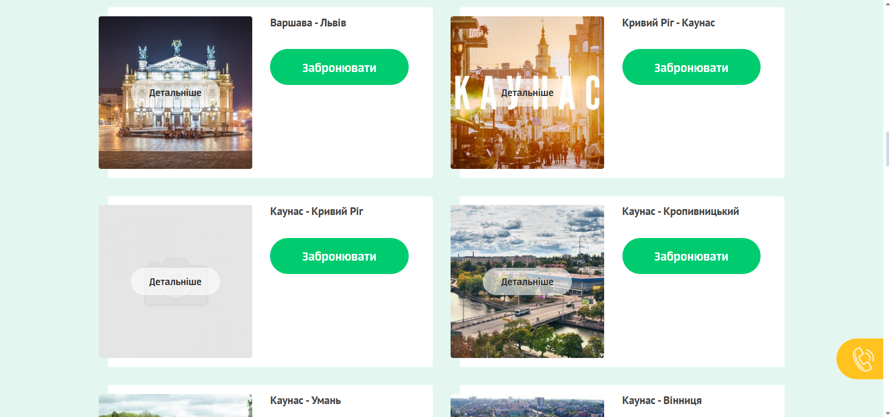
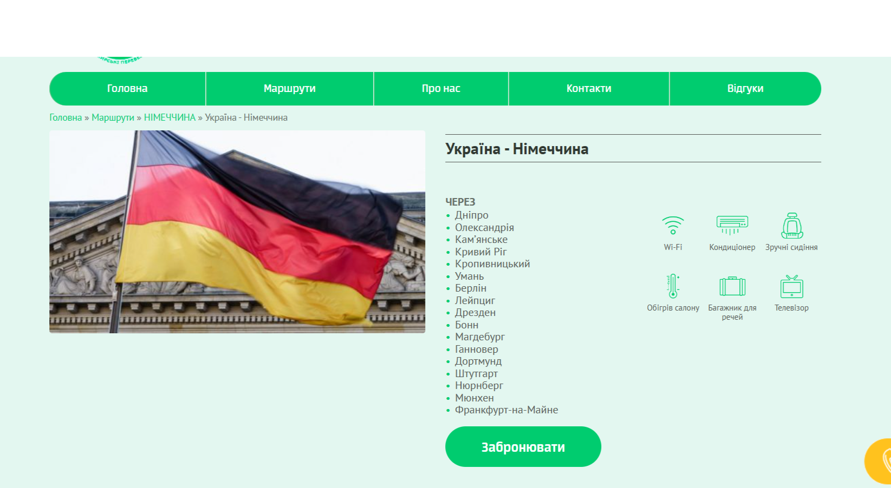
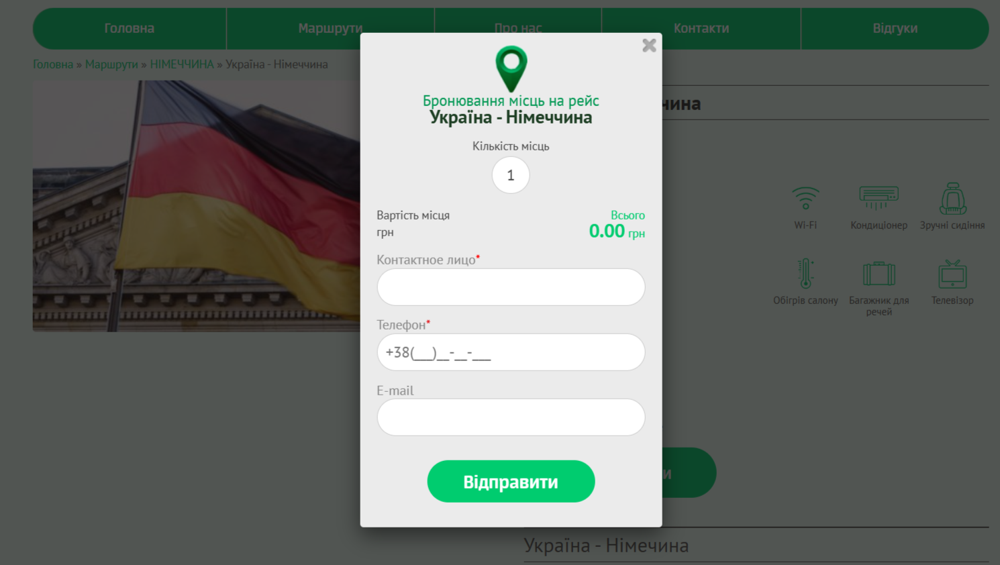
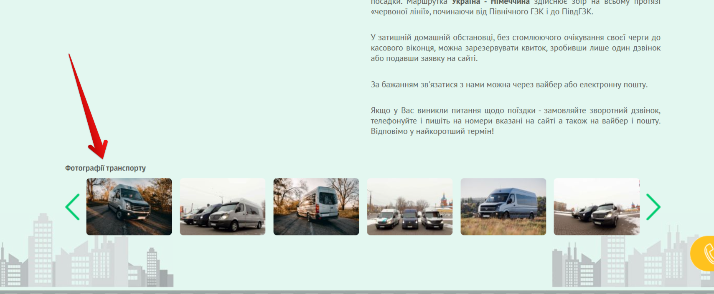
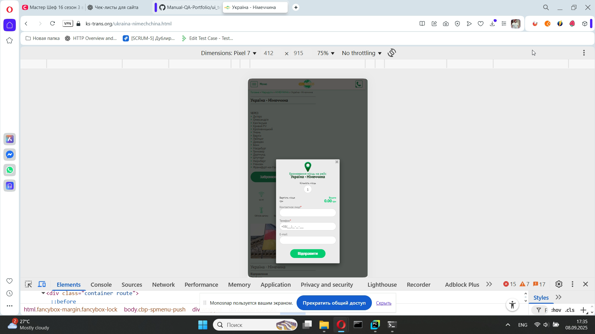

# 📄 Тест-кейсы: Routes (KS-Trans)

---

### TC-RT-014 – Проверка отображения списка маршрутов  
**Предусловие:**  
- Зайти на сайт [КС-ТРАНС](https://ks-trans.org).  

**Шаги:**  
1. В меню нажать «Дивитись усі напрямки».  

**Ожидаемый результат:**  
Открывается страница «Маршрути».  
Отображается список маршрутов, у каждой карточки есть:  
- название направления,  
- фото, 
- кнопка «Детальнiше»  
- кнопка «Забронювати».  

**Статус:** Fail  

 

---

### TC-RT-015 – Проверка перехода по маршруту  
**Предусловие:**  
- Зайти на сайт [КС-ТРАНС](https://ks-trans.org).  

**Шаги:**  
1.Выбрать меню «Маршрути».   
2.В подменю выбрать «НІМЕЧЧИНА»  
3.В разделе «НІМЕЧЧИНА» нажать на маршрут «Україна - Німеччина»  

**Ожидаемый результат:**  
Открывается страница маршрута с подробным описанием, фото и кнопкой «Забронювати».  

**Статус:** Pass  

  

---

### TC-RT-016 – Проверка кнопки «Забронювати» внутри маршрута  
**Предусловие:**  
1.Зайти на сайт [КС-ТРАНС](https://ks-trans.org).  
2.Выбрать меню «Маршрути». 
3.В подменю выбрать «НІМЕЧЧИНА» 
4.В разделе «НІМЕЧЧИНА» нажать на маршрут «Україна - Німеччина»  

**Шаги:**  
1. Нажать на кнопку «Забронювати».  

**Ожидаемый результат:**  
Открывается форма «Бронювання місць на рейс».  

**Статус:** Pass  

  

---

### TC-RT-017 – Проверка отображения фото транспорта  
**Предусловие:**  
1.Зайти на сайт [КС-ТРАНС](https://ks-trans.org).  
2.Выбрать меню «Маршрути».  
3.Открыть любой маршрут.  

**Шаги:**
1.Опуститься в самый низ страницы  
2.Посмотреть блок «Фотографії транспорту».  

**Ожидаемый результат:**  
Фото отображаются корректно, без искажений и битых ссылок.  

**Статус:** Pass  

  

---

### TC-RT-018 – Проверка адаптивности страницы маршрута  
**Предусловие:**   
1.Зайти на сайт [КС-ТРАНС](https://ks-trans.org)с мобильного устройства.  
 
**Шаги:**  
1.Выбрать меню «Маршрути». 
2.В подменю выбрать «НІМЕЧЧИНА» 
3.В разделе «НІМЕЧЧИНА» нажать на маршрут «Україна - Німеччина»
4.Нажать на кнопку «Забронювати». 
5.Нажать на крестик (×) закрытия формы.

**Ожидаемый результат:**  
Страница корректно отображается: фото и текст подстраиваются под размер экрана, кнопки доступны для клика.  

**Статус:** Pass  

  